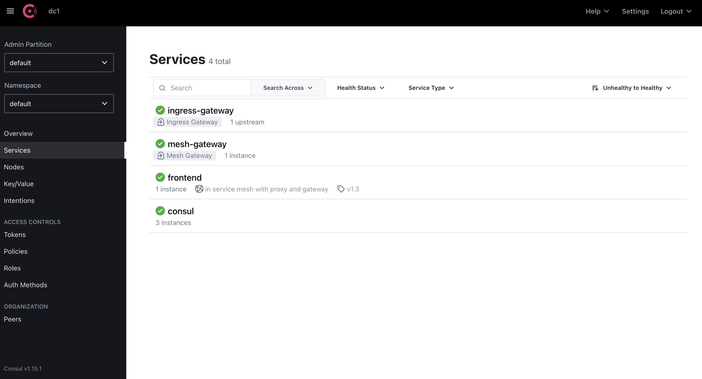
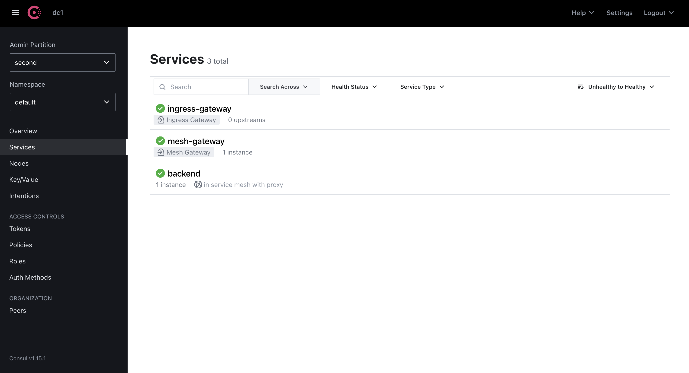

# Consul Cross-Partition Demo in GKE

> NOTE: Instead of GKE, you can use Minikube in your local environment. In that case you need to be sure that two Minikube profiles are running and that pods from one cluster profile are able to reach external services to the other cluster profile. So, try to avoid `docker` driver (KVM or QEMU recommended). Also, `LoadBalancer` type services are being used, so you would need some `minikube tunnel` or [MetalLB](https://metallb.universe.tf/) configured (you can install it with [addons](https://minikube.sigs.k8s.io/docs/commands/addons/))

> The following instructions are for the GKE use case.

This repo has a bash script that install Consul servers in one existing GKE cluster, then it creates an Admin Partition in a second existing GKE cluster, and configures a very basic demo to connect a `frontend` service running in one cluster to a `backend` service in the other cluster. It does the following:
* Configuration of the GKE clusters with API Gateway CRDs, bootstrap token and Consul license secrets 
* Deployment of Consul Servers with Admin Partitions enabled (Admin Partition `default`) in GKE 1
* Copy of the required secrets to GKE 2 to create a Consul Admin Partition
* Deployment of Consul components without servers and with Admin Partition `second` in GKE 2
* Creation of the required Consul CRDs objects for the demo
* Deployment of a `backend` service in cluster 1 and `frontend` service in cluster 2

## Requirements

There are some requirements to execute the script:
* A MacOs or Linux terminal (WSL in Windows should work, but I didn't test it)
* `kubectl`, `helm`, `gcloud` and `jq` CLI tools installed in your environment
* **GCP project** permissions to create and access GKE clusters
* Two **GKE clusters running** (or create them before executing the script). You can use [this Terraform](https://github.com/dcanadillas/tf-multi-gke), or by the following `gcloud` commands:
  ```
  $ gcloud container clusters create mycluster-0 --async -m n2-standard-2 -z europe-west1-b --num-nodes 3
  $ gcloud container clusters create mycluster-1 --async -m n2-standard-2 -z europe-west1-c --num-nodes 3
  ```
* **Google Cloud credentials** configured in your terminal:
  ```
  $ gcloud auth login
  $ gcloud config set project <your_gcp_project_id>
  ```
* A **Consul Enterprise license**, that should be set in the `CONSUL_LICENSE` environment variable, or setting the path of the license file in the `CONSUL_LICENSE_PATH` environment variable. 

## Executing the script

Check that `gcloud` is configured and that you can list the GKE clusters. Here is an example:

```
david ➜ ~ $ gcloud container clusters list
NAME                LOCATION        MASTER_VERSION    MASTER_IP      MACHINE_TYPE   NODE_VERSION      NUM_NODES  STATUS
dcanadillas-test-1  europe-west1-b  1.24.10-gke.1200  34.78.196.117  n1-standard-2  1.24.10-gke.1200  3          RUNNING
dcanadillas-test-0  europe-west1-c  1.24.10-gke.2300  34.77.232.46   n1-standard-2  1.24.10-gke.2300  3          RUNNING
```

Then, just run the `cross-partition.sh` script from this repo:

```
./cross-partition.sh <gke_cluster_name_1> <gke_cluster_name_2>
```

The script is going to ask for confirmation for several steps:
* You will be asked about using GKE or Minikube. **Select GKE**
  ```
  $ ./cross-partition.sh dcanadillas-test-0 dcanadillas-test-1

  ==> Checking Consul License...
  CONSUL_LICENSE=02MV4... ...FEVDPG4ZEIUJ5HU

  ==> Selecting K8s deployment type...
  Are you on "Minikube" or "GKE"?: GKE
  ```

* The script will show you the info from both GKE clusters and will create `consul` namespaces (you will see a `kubectl` error message if the namespace is already created, but you can ignore that) and it will install [Consul API Gateway objects](https://developer.hashicorp.com/consul/docs/api-gateway/install) (it is not needed in the demo, but it is installed in case you want to configure it later).
* It will stop before installing Consul in the first cluster. **Press `Enter` to continue** (`Ctrl-C` if you want to cancel).
  ```
  ....

  ==> Information from K8s Cluster 1...
  ....


  ==> Information from K8s Cluster 2...
  ....
  Archive:  consul_k8s.zip
    inflating: consul-k8s

  ==> Configuring K8s cluster dcanadillas-test-0
  Error from server (AlreadyExists): namespaces "consul" already exists
  customresourcedefinition.apiextensions.k8s.io/gatewayclassconfigs.api-gateway.consul.hashicorp.com unchanged
  customresourcedefinition.apiextensions.k8s.io/gatewayclasses.gateway.networking.k8s.io configured
  ....

  ==> Configuring K8s cluster dcanadillas-test-1
  Error from server (AlreadyExists): namespaces "consul" already exists
  customresourcedefinition.apiextensions.k8s.io/gatewayclassconfigs.api-gateway.consul.hashicorp.com unchanged
  customresourcedefinition.apiextensions.k8s.io/gatewayclasses.gateway.networking.k8s.io configured
  ....

  Continue to install Consul (Ctrl-C to cancel)...
  ```

* Consul installation will start, but it will ask you to *"Proceed with installation"*. **Press `Enter` or `Y`** to continue
* Consul servers in the first GKE cluster will be installed. Then you will see *Continue to install Consul partition "second"...*. **Press `Enter` to continue** (`Ctrl-C` if you want to cancel).
> You will probably see some "secrets not found" errors, but you can ignore them. It is trying to delete some secrets from previous installations in the namespace in case they exist.
* Once Consul is installed in the first cluster it will ask for confirmation to proceed with the Admin Partition installation. **Press `Enter` to continue** (`Ctrl-C` if you want to cancel).
  ```
  ....
  ....
    --> Add/Modify event for consul-server-acl-init-cleanup: MODIFIED
    --> Starting delete for "consul-server-acl-init-cleanup" Job
    ✓ Consul installed in namespace "consul".

  ==> Copying required K8s secrets for the Admin Partition installation...
  ....
  ....

  Continue to install Consul partition "second" (Ctrl-C to cancel)...
  ```
* Consul Admin Partition will be installed in the second GKE cluster. Also, all yaml files for the Consul configuration CRDs will be created in `/tmp/cross_partition_demo/` directory
* After being installed the Admin Partition in the second GKE cluster, last step is to deploy the saved yaml files in the correct GKE clusters. **Type "yes"** when asked to deploy:
  ```
  ==> Saving yaml files in "/tmp/cross_partition_demo"...

  All demo yaml files have been saved in directory "/tmp/cross_partition_demo":
  ....
  ....

  Do you want to deploy demo applications manifests in "/tmp/cross_partition_demo"? (You need to type: "yes" or "y"): yes

  proxydefaults.consul.hashicorp.com/global created
  proxydefaults.consul.hashicorp.com/global created
  service/frontend created
  serviceaccount/frontend created
  deployment.apps/frontend created
  service/backend created
  serviceaccount/backend created
  deployment.apps/backend created
  exportedservices.consul.hashicorp.com/second created
  serviceintentions.consul.hashicorp.com/frontend-default-to-backend-second created
  ```

## Access Consul and partitions

You can access to the Consul UI by using the `LoadBalancer` IP of the `consul-ui` service in the first GKE cluster (change):
```
$ kubectl get svc consul-ui \
  -n consul \
  -o jsonpath='{.status.loadBalancer.ingress[].ip}' \
  --kubeconfig /tmp/<gke_cluster_name_1>-kube.config
```

If you go to that IP in your browser you can check that both partitions are accessible:





To login to Consul for all the permission get the bootstrap token from the K8s secret:
```
kubectl get secret consul-bootstrap-token \
-n consul \
-o jsonpath='{.data.token}' \
--kubeconfig /tmp/<gke_cluster_name_1>-kube.config | base64 -d
```

## Files and assets

The script is saving all required CRDs yaml files to connect `frontend` and `backend` services in the directory `/tmp/cross_partition_demo`:
```
$ ls -l /tmp/cross_partition_demo/
total 40
-rw-r--r--@ 1 david  wheel  1142 Mar 17 10:27 backend.yaml
-rw-r--r--@ 1 david  wheel   457 Mar 17 10:27 exported-backend.yaml
-rw-r--r--@ 1 david  wheel  1429 Mar 17 10:27 frontend.yaml
-rw-r--r--@ 1 david  wheel   232 Mar 17 10:27 intention-frontend_default-backend_second.yaml
-rw-r--r--@ 1 david  wheel   153 Mar 17 10:27 proxydefaults.yaml
```

After the script execution, you can find your `kubeconfig` files for the different clusters in `/tmp`. Files are named as `<gke_cluster_name>-kube.config`:
```
$ ls -l /tmp/
total 48
...
-rw-------@ 1 david  wheel  2972 Mar 17 10:31 dcanadillas-test-0-kube.config
-rw-------@ 1 david  wheel  2973 Mar 17 10:31 dcanadillas-test-1-kube.config
...
```

So you can use different terminal panes/windows connected to your different GKE clusters, just by doing `export KUBECONFIG=/tmp/<gke_cluster_name>-kube.config`. In that case you can check both Kubernetes clusters within the same terminal y different shell sesions.

I have included also in this repo the similar example files definitions used by the script:
* In directory `./crds` you will find all the `yaml` files for Consul configuration CRDs
* `./consul-values/consul-dc1-servers.yaml` contains the values yaml to deploy a Consul control plane with `default` partition
* `./consul-values/consul-second-partition.yaml` contains a values yaml example to deploy Consul admin partition named `second`
* Directory `./demo-app` contains the services manifests to deploy in K8s

## Demoing

When the script is executed successfully you should have the following services running:
* A `frontend` service running in admin partition `default`, which is deployed in the first GKE cluster
* A `backend` service running in admin partition `second`, which is deployed in the second GKE cluster

You can check that the `frontend` service in one partition can reach `backend` service in the second partition in several ways. You can check within the `frontend` pod just by `curl http://backend.virtual.second.ap.consul:8080` and getting the response. But let's use the Ingress Gateway deployed in Consul to access from the outside. 

Let's configure the `API Gateway` in the first GKE cluster to access the `frontend` service and create a Consul intention to allow the communication (be sure to run this using the kubeconfig file from the first GKE cluster).

First, we deploy the API Gateway:

```
kubeclt apply -f <<EOF
apiVersion: gateway.networking.k8s.io/v1beta1
kind: Gateway
metadata:
 name: api-gateway
 namespace: default
spec:
 gatewayClassName: consul
 listeners:
 - protocol: HTTPS
   port: 9443
   name: https
   allowedRoutes:
     namespaces:
       from: Same
   tls:
     certificateRefs:
       - name: consul-server-cert
         namespace: consul
```

Because we are using a HTTPS listener, let's deploy a `ReferenceGrant` that let the listener to access the certificate to expose:

```
---
apiVersion: gateway.networking.k8s.io/v1alpha2
kind: ReferenceGrant
metadata:
  name: consul-reference-grant
  namespace: consul
spec:
  from:
  - group: gateway.networking.k8s.io
    kind: Gateway
    namespace: default
  to:
  - group: ""
    kind: Secret
    name: consul-server-cert

```

And we need to create the Consul intention to allow communication in the mesh between the API Gateway and the `frontend` service:
```
---
apiVersion: consul.hashicorp.com/v1alpha1
kind: ServiceIntentions
metadata:
  name: apigw-to-frontend
spec:
  destination:
    name: frontend
  sources:
   - name: api-gateway
     action: allow
     partition: default
EOF
```

After deploying the API Gateway you can check the connectivity (using the kubeconfig for the first GKE cluster,  `export KUBECONFIG=/tmp/<gke_cluster_name_1>-kube.config`):
```
$ curl -k https://$(kubectl get svc api-gateway -o jsonpath='{.status.loadBalancer.ingress[].ip}'):9443/full
Hello from beautiful frontend World and... Hello from backend World
```

Then, you can delete the Consul intention and check that `backend` cannot be reached  anymore from `frontend` (probably you need to run twice the `curl` command):
```
$ kubectl delete serviceintentions apigw-to-frontend
$ curl http://$(kubectl get svc consul-ingress-gateway -n consul -o jsonpath='{.status.loadBalancer.ingress[].ip}'):8080/full
RBAC: access denied
```

## Peering (WIP)

If you add a third K8s cluster you can also test the peering connection. You can follow the added guided [in here](./peering/Peering.md).


